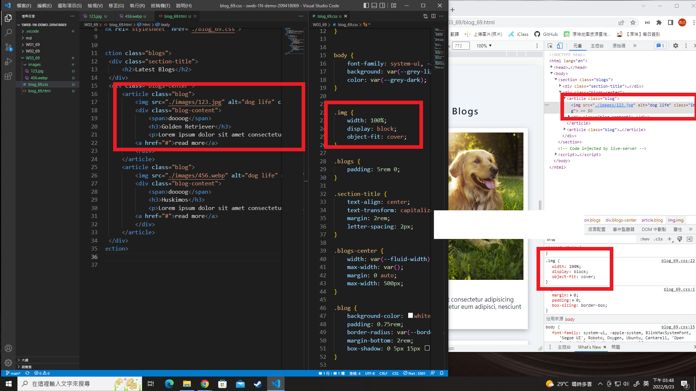
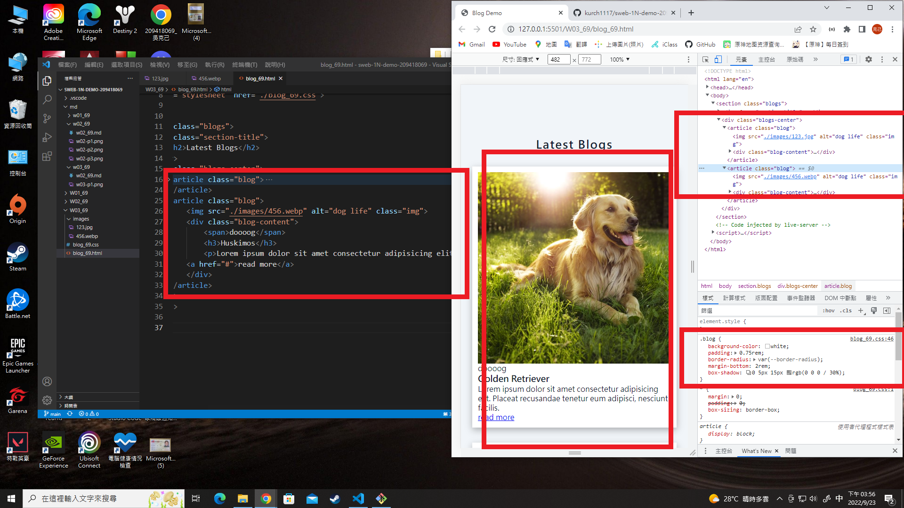
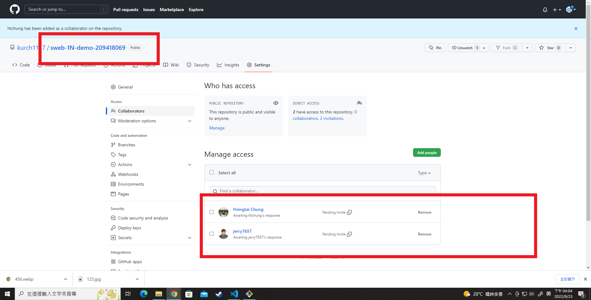

### W03-P1: Display the image of the first blog with Chrome DevTools



### W03-P2: Display second blog using Chrome DevTools



### W03-P3: W3 all logs


```
$ git log --pretty=format:"%h%x09%an%x09%ad%x09%s" --after="2022-09-20"
6162bf9 kurch1117       Fri Sep 23 15:59:47 2022 +0800  W03-P2: Display second blog using Chrome DevTools
c35815d kurch1117       Fri Sep 23 15:53:20 2022 +0800  W03-P1: Display the image of the first blog with Chrome

```
### W03-P4: Github分享給老師及助教
