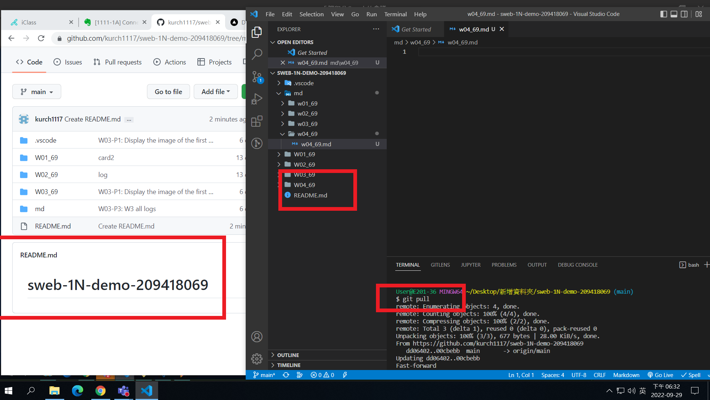
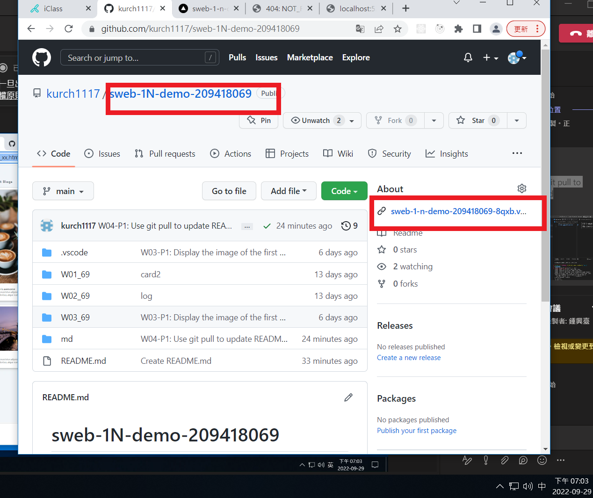
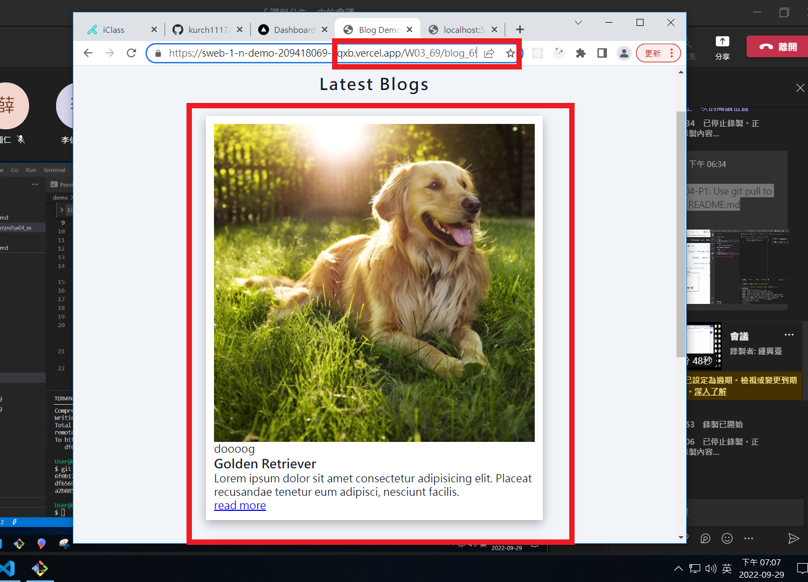
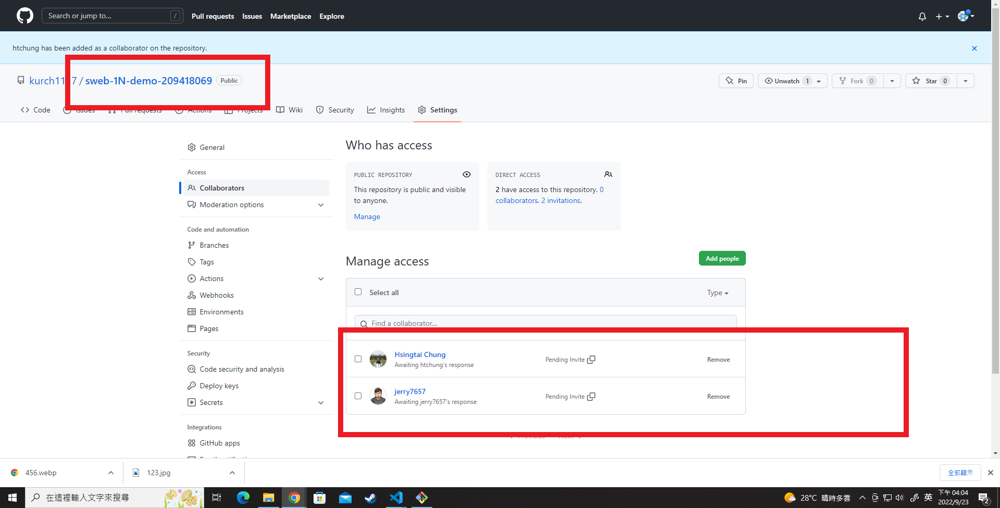
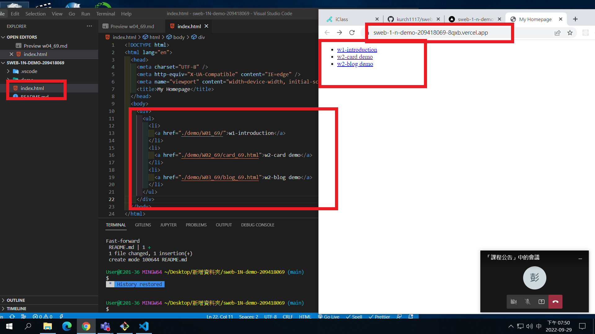
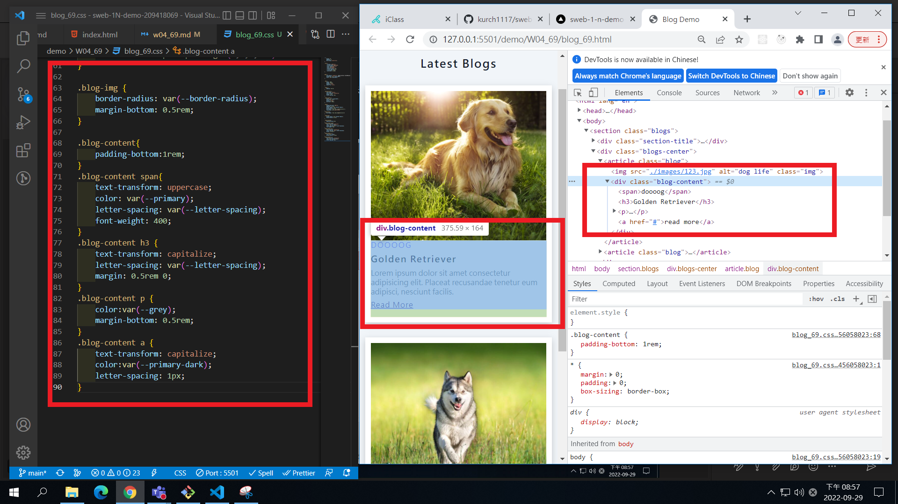
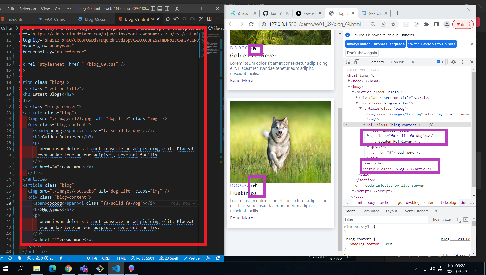
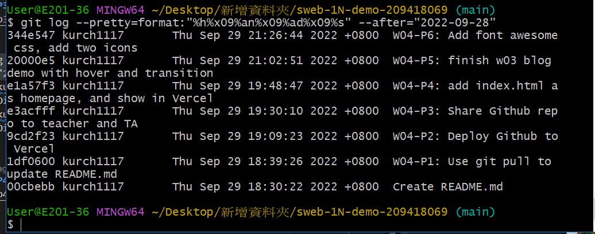

### Github repo ur1

[my github repo](https://github.com/kurch1117/sweb-1N-demo-209418069)

### W04-P1: Use git pull to update README.md



### W04-P2: Deploy Github to Vercel





### w04-p3: Share Github repo to teacher and TAs



### W04-P4: add index.html as homepage, and show in Vercel



### W04-P5: finish w03 blog demo with hover and transition



### W04-P6: Add font awesome css, add two icons



### W04-P7: W4 all logs



```
$ git log --pretty=format:"%h%x09%an%x09%ad%x09%s" --after="2022-09-28"
344e547 kurch1117       Thu Sep 29 21:26:44 2022 +0800  W04-P6: Add font awesome css, add two icons
20000e5 kurch1117       Thu Sep 29 21:02:51 2022 +0800  W04-P5: finish w03 blog demo with hover and transition
e1a57f3 kurch1117       Thu Sep 29 19:48:47 2022 +0800  W04-P4: add index.html as homepage, and show in Vercel
e3acfff kurch1117       Thu Sep 29 19:30:10 2022 +0800  W04-P3: Share Github repo to teacher and TA
9cd2f23 kurch1117       Thu Sep 29 19:09:23 2022 +0800  W04-P2: Deploy Github to Vercel
1df0600 kurch1117       Thu Sep 29 18:39:26 2022 +0800  W04-P1: Use git pull to update README.md
00cbebb kurch1117       Thu Sep 29 18:30:22 2022 +0800  Create README.md


```
