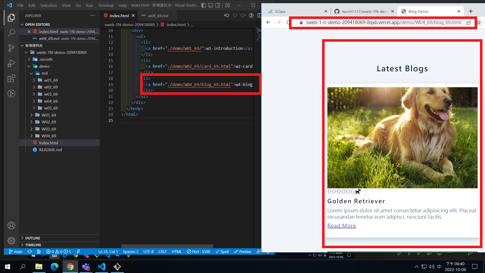
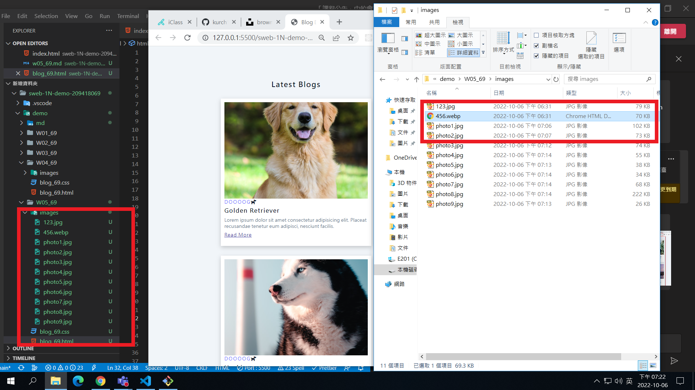
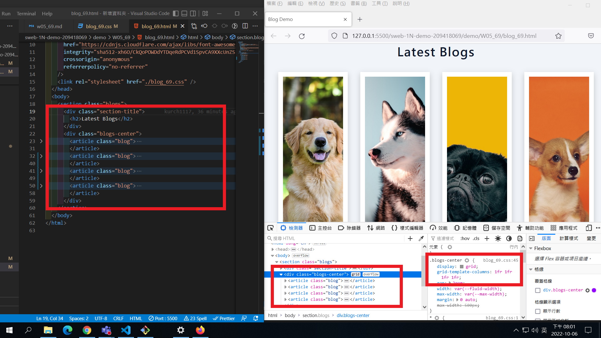
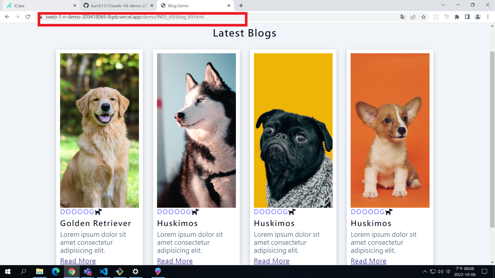
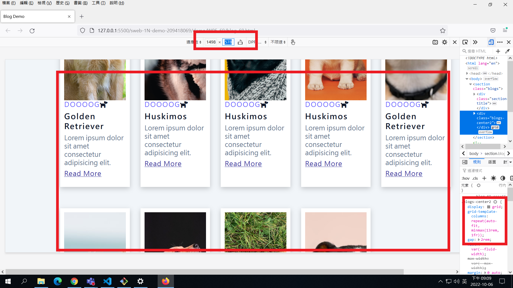
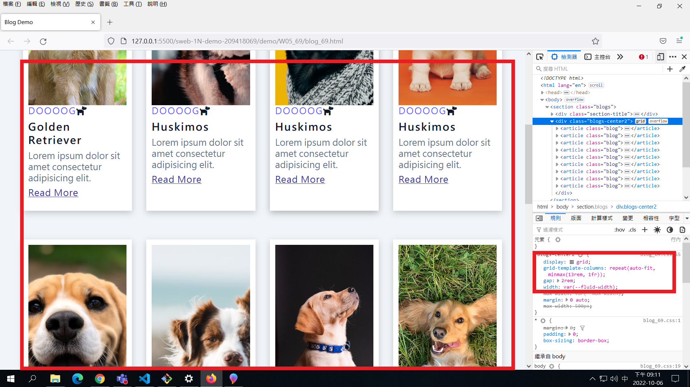
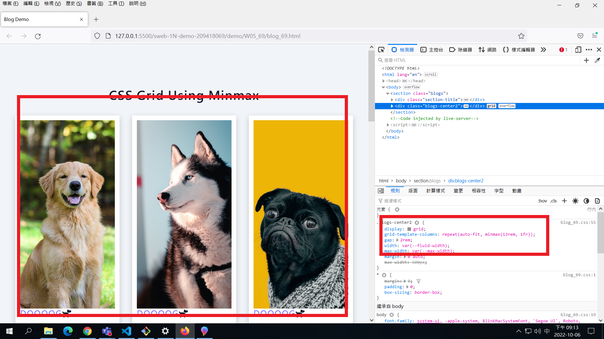
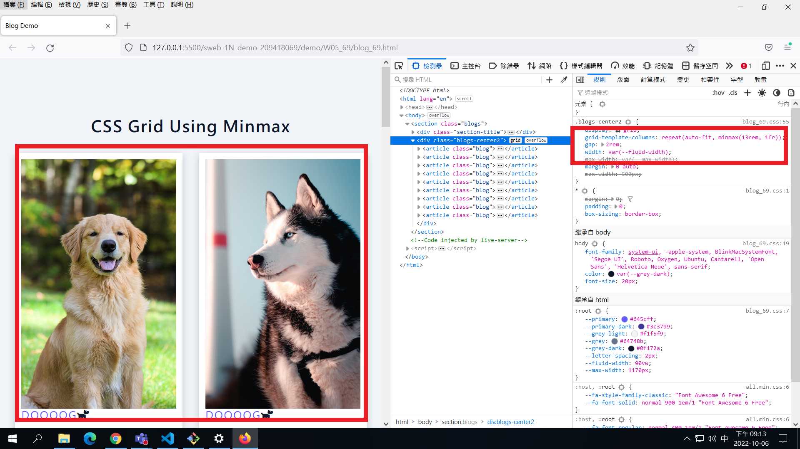
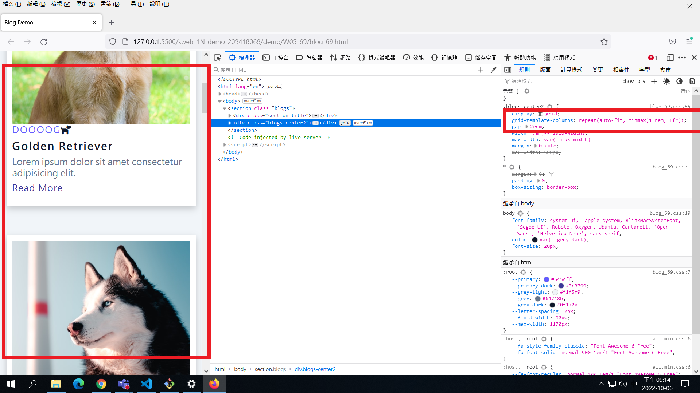
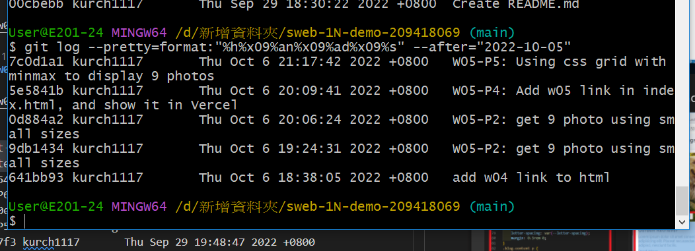

### Github repo ur1

[my github repo](https://github.com/kurch1117/sweb-1N-demo-209418069)

### W05-P1: add w04 link in index.html



### W05-P2: get 9 photo using small sizes



### W05-P3: Use grid to show 4 photos in a row



### W05-P4: Add w05 link in index.html, and show it in Vercel



### W05-P5: Using css grid with minmax to display 9 photos











### W05-P6: W4 all logs



```
$ git log --pretty=format:"%h%x09%an%x09%ad%x09%s" --after="2022-10-05"
7c0d1a1 kurch1117       Thu Oct 6 21:17:42 2022 +0800   W05-P5: Using css grid with minmax to display 9 photos
5e5841b kurch1117       Thu Oct 6 20:09:41 2022 +0800   W05-P4: Add w05 link in index.html, and show it in Vercel
0d884a2 kurch1117       Thu Oct 6 20:06:24 2022 +0800   W05-P2: get 9 photo using small sizes
9db1434 kurch1117       Thu Oct 6 19:24:31 2022 +0800   W05-P2: get 9 photo using small sizes
641bb93 kurch1117       Thu Oct 6 18:38:05 2022 +0800   add w04 link to html

```
