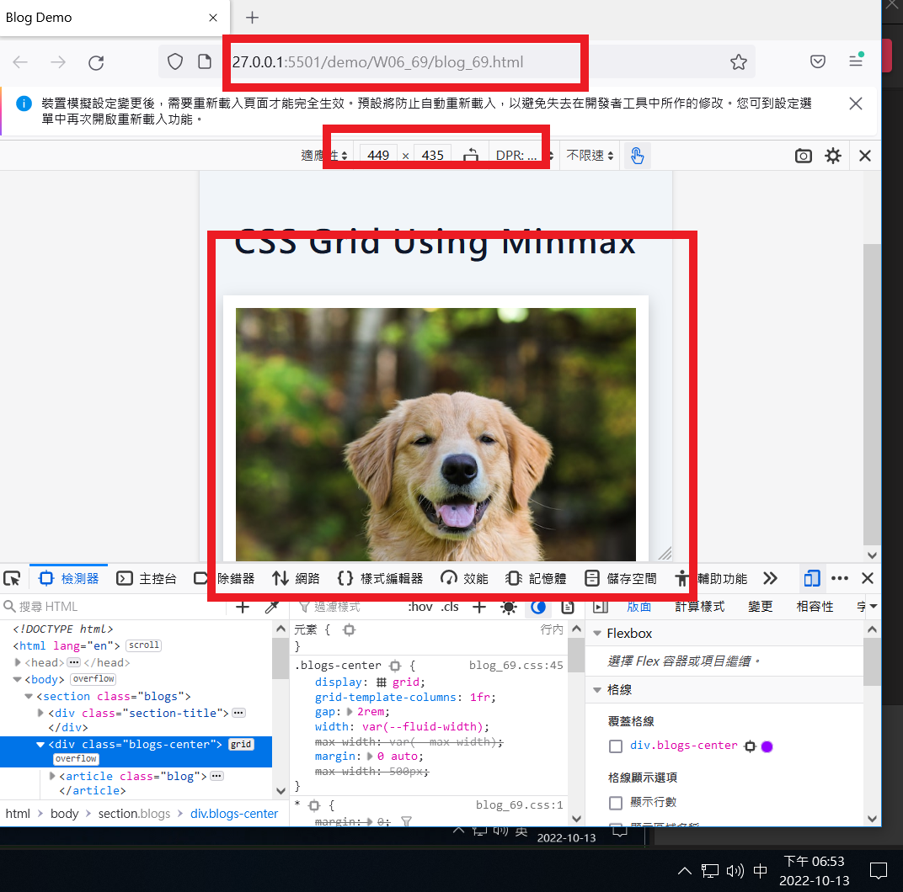
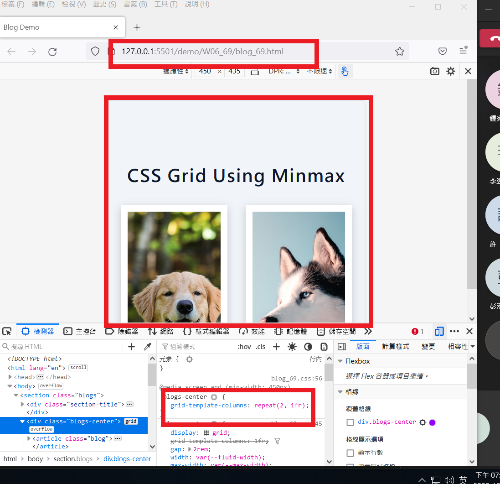
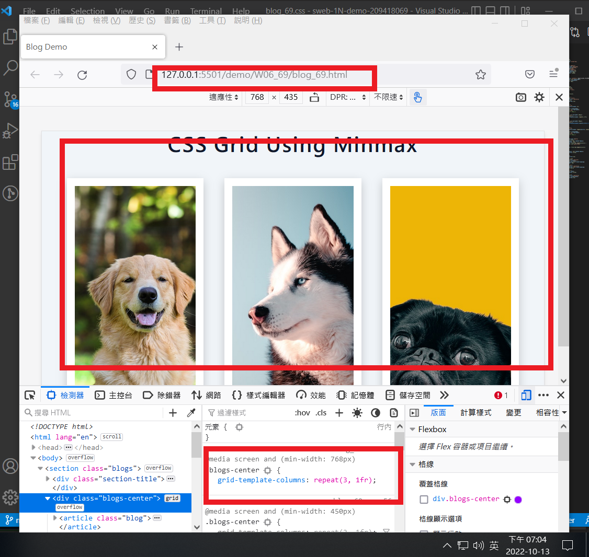
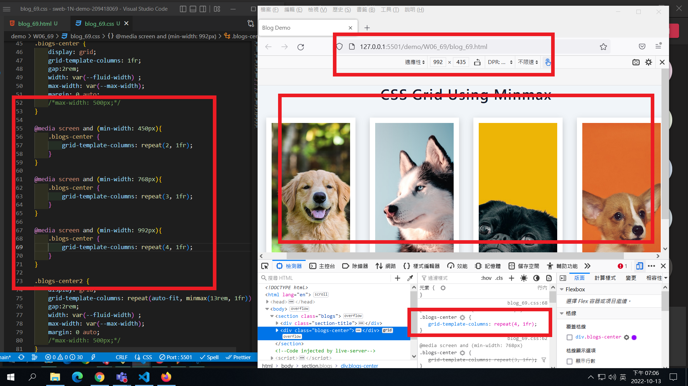
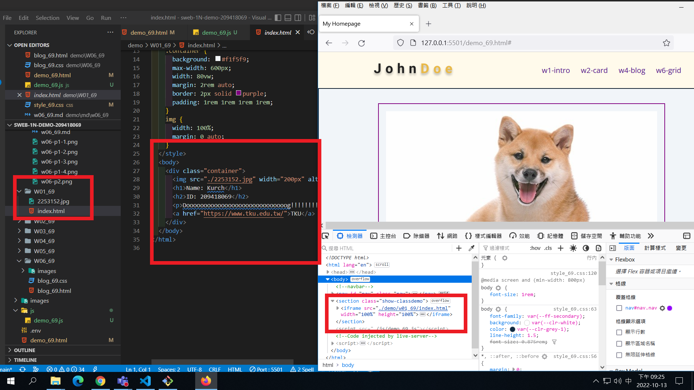

### Github repo ur1

[my github repo](https://github.com/kurch1117/sweb-1N-demo-209418069)

### W06-P1: add 3 breakpoints for different devices









### W06-P2: add navbar for demo links


### W06-P3: run 4 classdemo one by one




### W06-logs: W4 all logs


```
$ git log --pretty=format:"%h%x09%an%x09%ad%x09%s" --after="2022-10-12"
f5b0050 kurch1117       Thu Oct 13 21:30:26 2022 +0800  W06-P3: run 4 classdemo one by one
ad82127 kurch1117       Thu Oct 13 20:28:10 2022 +0800  W06-P2: add navbar for demo links
01ce889 kurch1117       Thu Oct 13 19:10:34 2022 +0800  W06-P1: add 3 breakpoints for different devices
```
