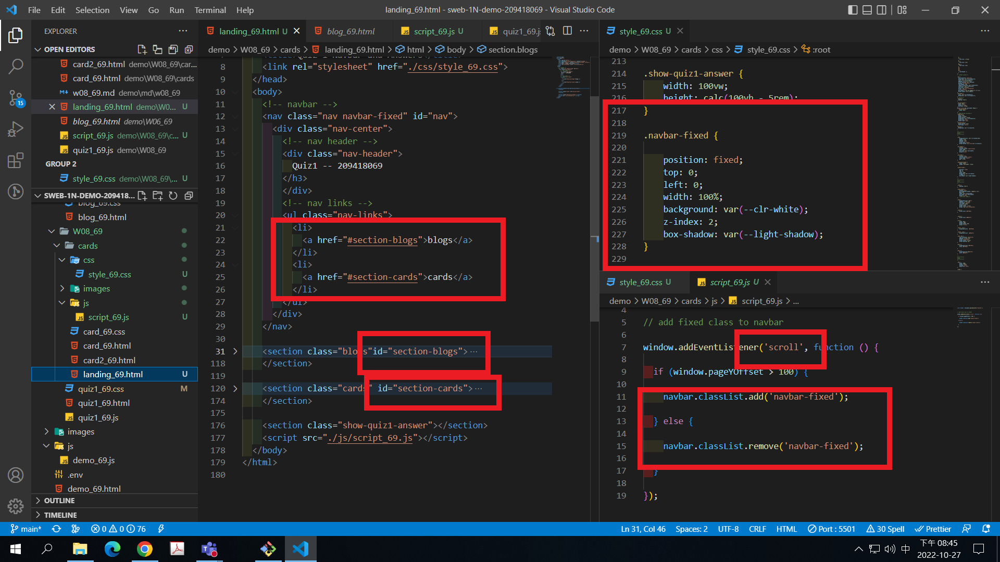
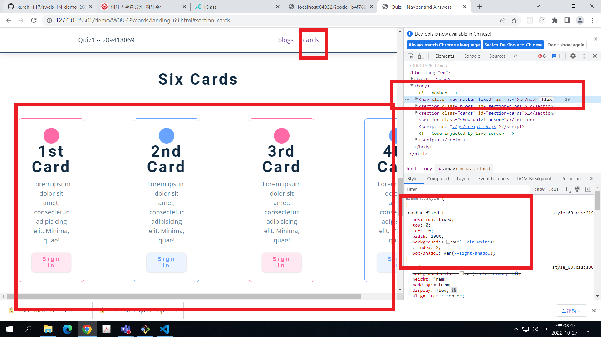
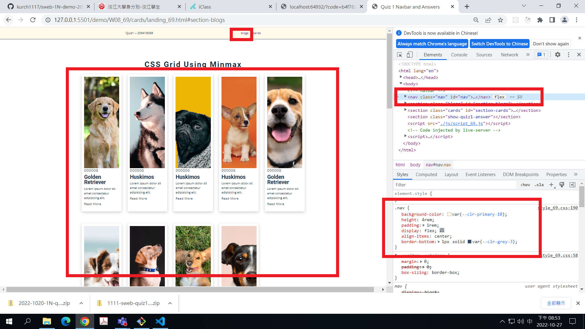
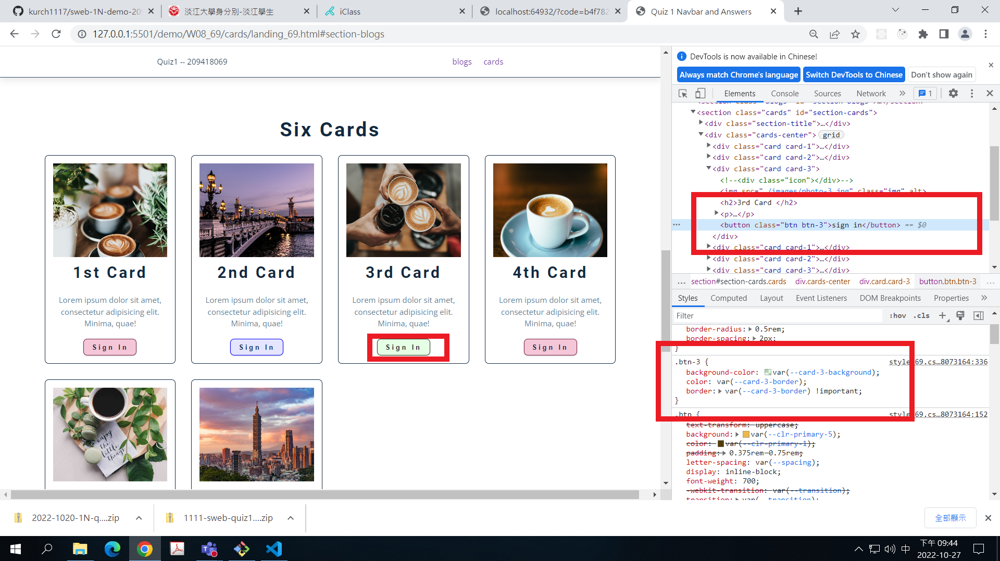
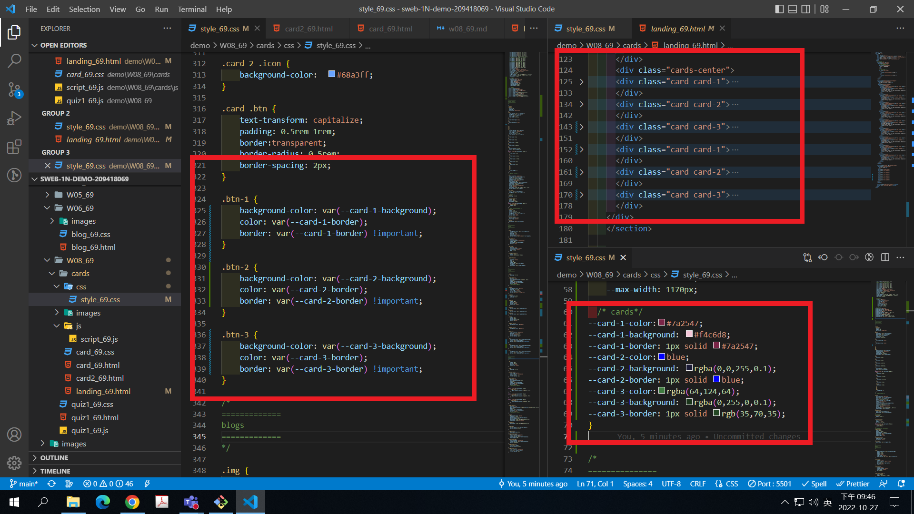

### Github repo ur1

[my github repo](https://github.com/kurch1117/sweb-1N-demo-209418069)

### w08-P1: navbar with card1 and card2

### w08-P2: fixed navbar setup and two sections with two links

### w08-P3: define css variables for .btn-1, .btn-2, .btn3

