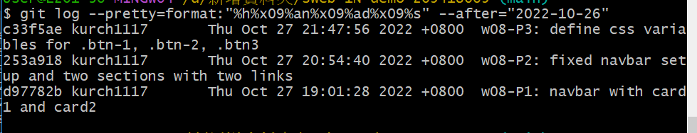

### Github repo ur1

[my github repo](https://github.com/kurch1117/sweb-1N-demo-209418069)

### w08-P1: navbar with card1 and card2


### w08-P2: fixed navbar setup and two sections with two links


### w08-P3: define css variables for .btn-1, .btn-2, .btn3


### W06-logs: W4 all logs



```
$ git log --pretty=format:"%h%x09%an%x09%ad%x09%s" --after="2022-10-26"
c33f5ae kurch1117       Thu Oct 27 21:47:56 2022 +0800  w08-P3: define css variables for .btn-1, .btn-2, .btn3
253a918 kurch1117       Thu Oct 27 20:54:40 2022 +0800  w08-P2: fixed navbar setup and two sections with two links
d97782b kurch1117       Thu Oct 27 19:01:28 2022 +0800  w08-P1: navbar with card1 and card2

```
