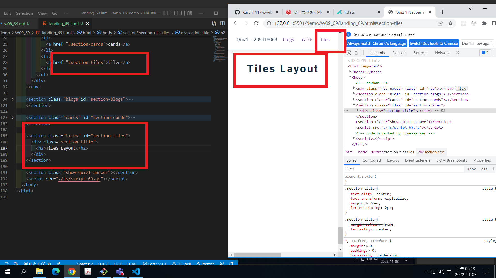
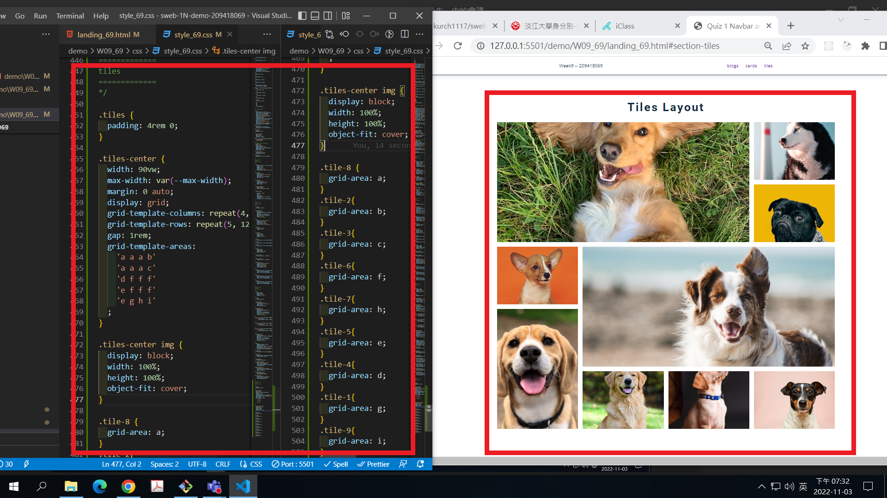
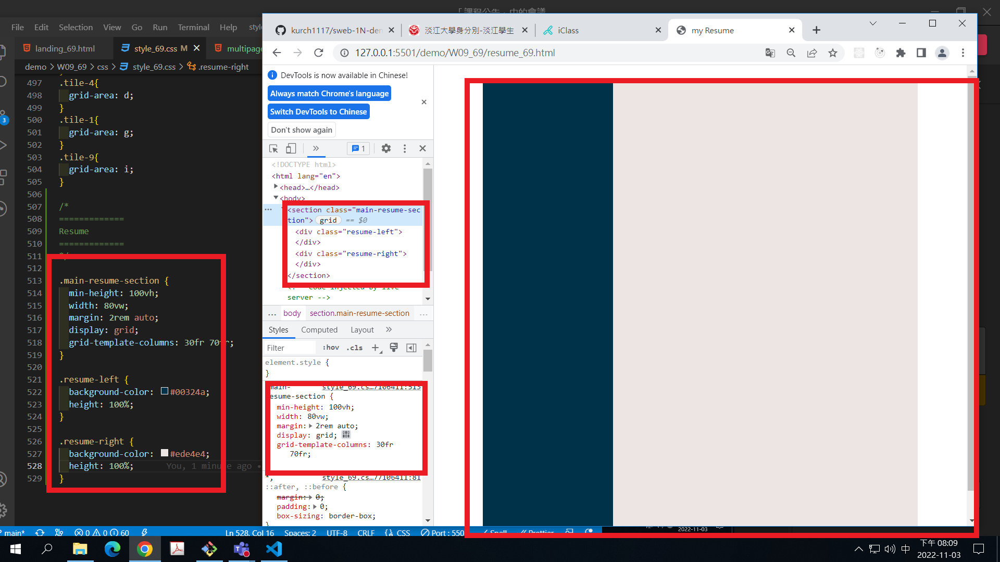
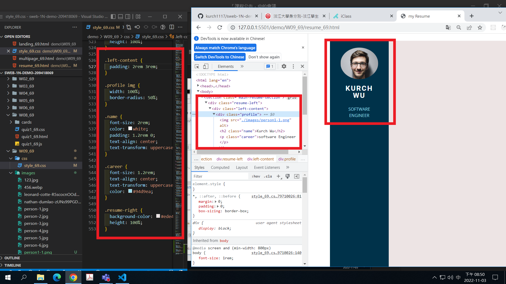
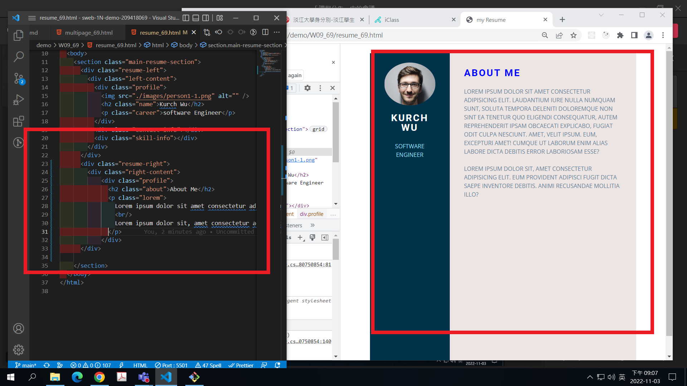
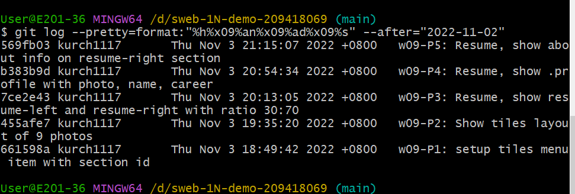

### Github repo ur1

[my github repo](https://github.com/kurch1117/sweb-1N-demo-209418069)

### w09-P1: setup tiles menu item with section id



### w09-P2: Show tiles layout of 9 photos



### w09-P3: Resume, show resume-left and resume-right with ratio 30:70



### w09-P4: Resume, show .profile with photo, name, career



### w09-P5: Resume, show about info on resume-right section



### w09-logs: w09 logs



```

$ git log --pretty=format:"%h%x09%an%x09%ad%x09%s" --after="2022-11-02"
569fb03 kurch1117       Thu Nov 3 21:15:07 2022 +0800   w09-P5: Resume, show about info on resume-right section
b383b9d kurch1117       Thu Nov 3 20:54:34 2022 +0800   w09-P4: Resume, show .profile with photo, name, career
7ce2e43 kurch1117       Thu Nov 3 20:13:05 2022 +0800   w09-P3: Resume, show resume-left and resume-right with ratio 30:70
455afe7 kurch1117       Thu Nov 3 19:35:20 2022 +0800   w09-P2: Show tiles layout of 9 photos
661598a kurch1117       Thu Nov 3 18:49:42 2022 +0800   w09-P1: setup tiles menu item with section id


```
