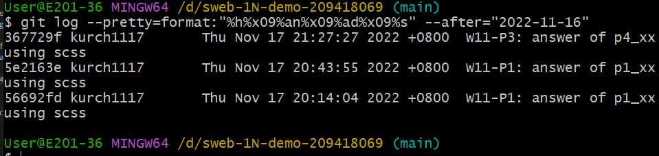

### Github repo ur1

[my github repo](https://github.com/kurch1117/sweb-1N-demo-209418069)

### W11-P1: answer of p2_xx using scss


### W11-P2: answer of p3_xx using scss


### W11-P3: answer of p4_xx using scss




```
 $ git log --pretty=format:"%h%x09%an%x09%ad%x09%s" --after="2022-11-16"
367729f kurch1117       Thu Nov 17 21:27:27 2022 +0800  W11-P3: answer of p4_xx using scss
5e2163e kurch1117       Thu Nov 17 20:43:55 2022 +0800  W11-P1: answer of p1_xx using scss
56692fd kurch1117       Thu Nov 17 20:14:04 2022 +0800  W11-P1: answer of p1_xx using scss


```