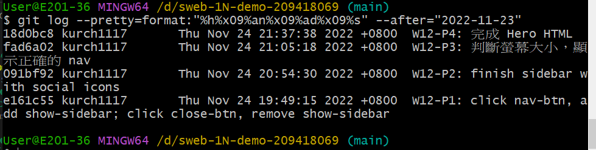

### Github repo ur1

[my github repo](https://github.com/kurch1117/sweb-1N-demo-209418069)

### W12-P1: click nav-btn, add show-sidebar; click close-btn, remove show-sidebar


### W12-P2: finish sidebar with social icons


### W12-P3: 判斷螢幕大小，顯示正確的 nav




```
 $ git log --pretty=format:"%h%x09%an%x09%ad%x09%s" --after="2022-11-23"
fad6a02 kurch1117       Thu Nov 24 21:05:18 2022 +0800  W12-P3: 判斷螢幕大小，顯示正確的 nav
091bf92 kurch1117       Thu Nov 24 20:54:30 2022 +0800  W12-P2: finish sidebar with social icons
e161c55 kurch1117       Thu Nov 24 19:49:15 2022 +0800  W12-P1: click nav-btn, add show-sidebar; click close-btn, remove show-sidebar


```