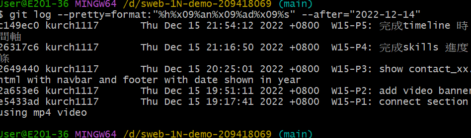

### Github repo ur1

[my github repo](https://github.com/kurch1117/sweb-1N-demo-209418069)

### W15-P1: connect section using mp4 video

 


### W15-P2: add video banner

 


### W15-P3: show contact_xx.html with navbar and footer with date shown in year


### W15-P4: 完成skills 進度條


### W15-P5: 完成timeline 時間軸


```
 $ git log --pretty=format:"%h%x09%an%x09%ad%x09%s" --after="2022-12-14"
c149ec0 kurch1117       Thu Dec 15 21:54:12 2022 +0800  W15-P5: 完成timeline 時
間軸
26317c6 kurch1117       Thu Dec 15 21:16:50 2022 +0800  W15-P4: 完成skills 進度
條
2649440 kurch1117       Thu Dec 15 20:25:01 2022 +0800  W15-P3: show contact_xx.html with navbar and footer with date shown in year
2a653e6 kurch1117       Thu Dec 15 19:51:11 2022 +0800  W15-P2: add video banner
e5433ad kurch1117       Thu Dec 15 19:17:41 2022 +0800  W15-P1: connect section using mp4 video

```
