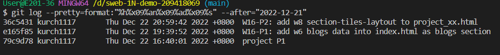

### Github repo ur1

[my github repo](https://github.com/kurch1117/sweb-1N-demo-209418069)

### W16-P1: add w6 blogs data into index.html as blogs section

 


### W16-P2: add w8 section-tiles-laytout to project_xx.html

 


```
 $ git log --pretty=format:"%h%x09%an%x09%ad%x09%s" --after="2022-12-21"
36c5431 kurch1117       Thu Dec 22 20:59:42 2022 +0800  W16-P2: add w8 section-tiles-laytout to project_xx.html
e165f85 kurch1117       Thu Dec 22 19:39:52 2022 +0800  W16-P1: add w6 blogs data into index.html as blogs section
79c9d78 kurch1117       Thu Dec 22 16:40:01 2022 +0800  project P1

```
