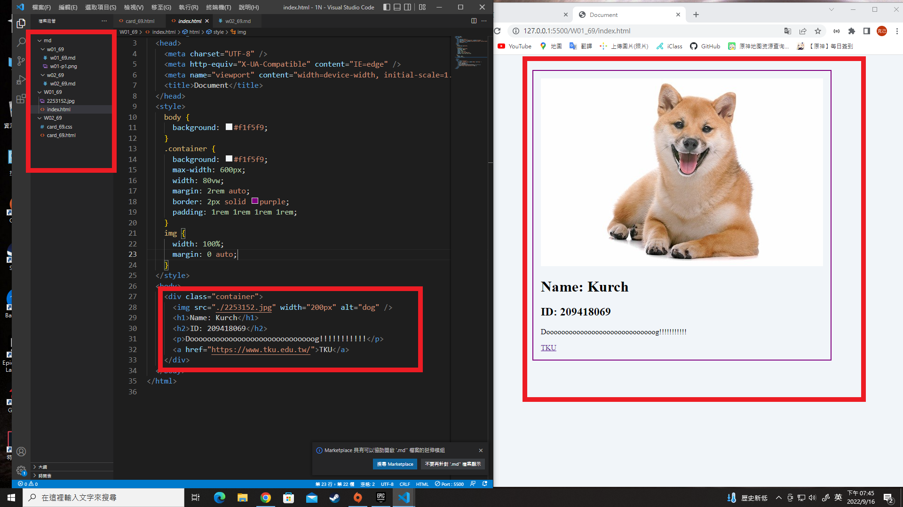
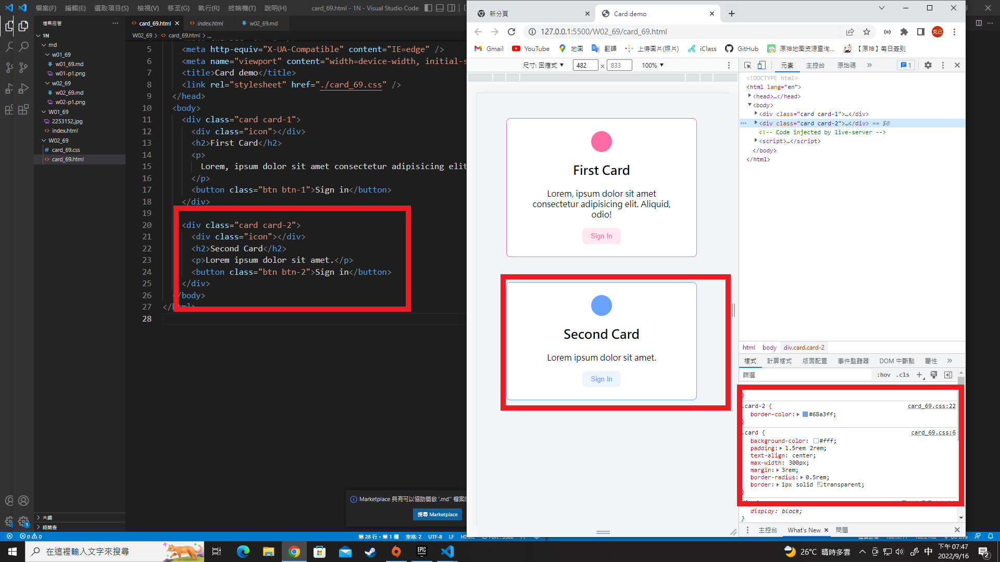
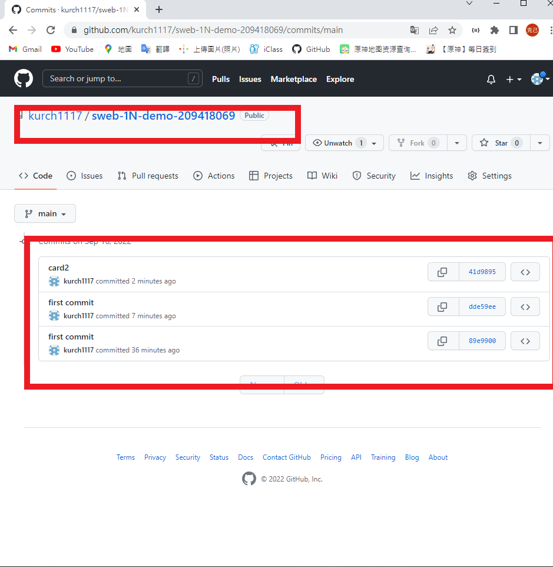

### Github repo ur1

[my giyhub repo](https://github.com/kurch1117/sweb-1N-demo-209418069)

### W02-p1: prepare classdemo for first commit

### W02-p2: card demo with 2 card (pink and blue)

### W03-p3: W2 all logs

